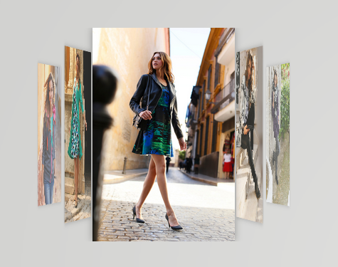

# Coverflow Add-on for Vaadin 7

The Coverflow component is an animated image gallery which uses CSS3 3D effects of the jQuery Flipster Addon (https://github.com/drien/jquery-flipster).



### Features:
- 3D CSS effects
- imageSelectionListener fires in every client-side navigation
- adjust max image size
- this add-on loads jquery.min.js

## Usage

### Maven

```xml
<dependency>
    <groupId>org.vaadin.addons</groupId>
	<artifactId>vaadin-coverflow</artifactId>
	<version>1.0.0</version>
</dependency>
```

No widgetset required.

## Download release

Official releases of this add-on are available at Vaadin Directory. For Maven instructions, download and reviews, go to http://vaadin.com/addon/vaadin-coverflow

## Building and running demo

git clone https://github.com/bonprix/vaadin-coverflow
mvn clean install
cd demo
mvn jetty:run

To see the demo, navigate to http://localhost:8080/
 
## Release notes

### version 2.0.0
- autoplay: set time for automatic item change
- styles: choose from four styles. Carousel, CoverFlow, Flat or Wheel
- navigation: choose if you want back and previous buttons shown
- callback method for clicking frontmost item 
- category and title available in item-changed callback method

### version 1.1.0
- updated libraries to jquery 3.1.1 and flipster 1.1.2
- fixes issues #1 and #2

### Version 1.0.0
- Bleeding edge :)
- implemented basic features of the coverflow 

## Known issues

- The CoverFlow#maxSize() method accepts values bigger than the actual available space of the element on client side. This causes the images to be that large that the images are (a) larger than the coverflow component itself and (b) navigation may not be possible because the main image covers the next right image. It is planned to change this behavior in a future release.
- Mixing images with different aspect ratios may also cause space and navigation problems so far


## Roadmap

This component is developed as a hobby with no public roadmap or any guarantees of upcoming releases. That said, the following features are planned for upcoming releases:
- set the selected image element from server side
- add image click listener
- optimize rendering size of the images (maybe automate it to a percentage value)

## Issue tracking

The issues for this add-on are tracked on its github.com page. All bug reports and feature requests are appreciated. 

## Contributions

Contributions are welcome, but there are no guarantees that they are accepted as such. Process for contributing is the following:
- Fork this project
- Create an issue to this project about the contribution (bug or feature) if there is no such issue about it already. Try to keep the scope minimal.
- Develop and test the fix or functionality carefully. Only include minimum amount of code needed to fix the issue.
- Refer to the fixed issue in commit
- Send a pull request for the original project
- Comment on the original issue that you have implemented a fix for it

## License & Author

Add-on is distributed under MIT License. For license terms, see LICENSE.txt.

vaadin-scrollable-panel is written by members of Bonprix Handelsgesellschaft mbh:
- Christian Thiel (https://github.com/stoerti)

# Developer Guide

## Getting started

Here is a simple example on how to try out the add-on component:

```java

// create url list
final List<String> imgUrls = new ArrayList<String>();
// fill list with http URLs

// Initialize the coverflow
final CoverFlow coverFlow = new CoverFlow(imgUrls);
coverFlow.setCoverflowStyle(CoverflowStyle.CAROUSEL);
coverFlow.setMaxImageSize(300);

layout.addComponent(coverFlow);

// add image selection listener
coverFlow.addImageSelectionListener(
	new ImageSelectionListener() {

		@Override
		public void onImageSelection(final ImageSelectionEvent event) {
			Notification.show("Selected Element: " + event.getSelectedIndex() + " " + event.getUrl());
		}

	};

);

```


For a more comprehensive example, see src/test/java/org/vaadin/template/demo/DemoUI.java
